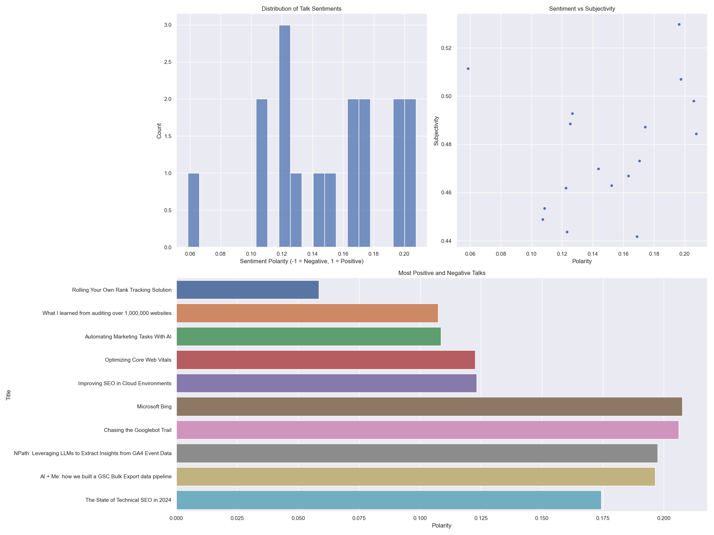

# Conference Talk Sentiment Analysis

## Overall Conference Sentiment

• Average Sentiment: 0.150
• Sentiment Standard Deviation: 0.041
• Average Subjectivity: 0.478

## Most Positive Talks

## Most Negative Talks

## Objectivity Analysis

### Most Objective Talks

### Most Subjective Talks

## Overall Sentiment Analysis

